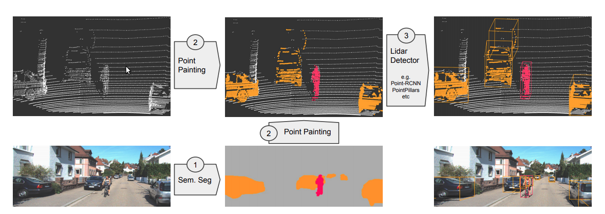
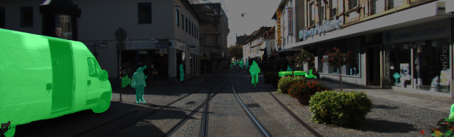
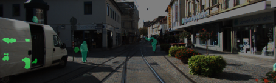
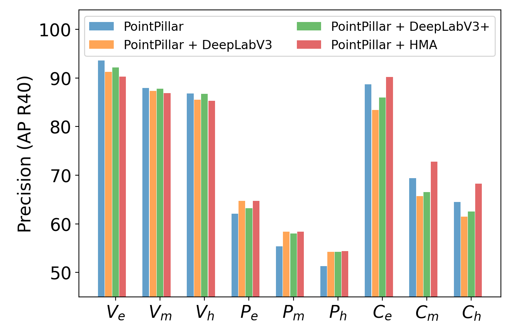
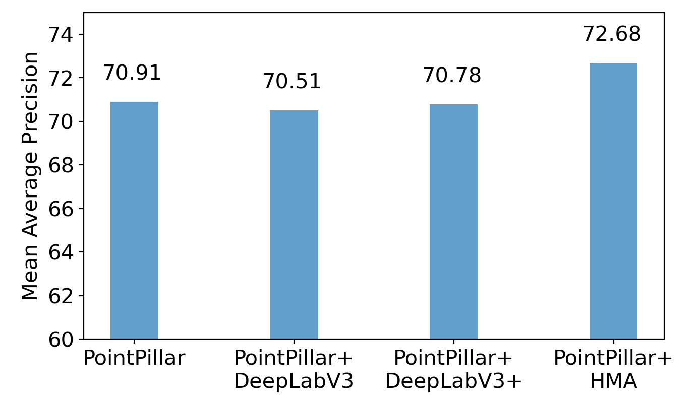

# PointPainting
This repository aims to build an open-source PointPainting package which is easy to understand, deploy and run! We refer to the idea in the [original paper](https://arxiv.org/abs/1911.10150) to implement this open-source framework to conduct the sequential 3D object detection. We utilize the Pytorch and mmsegmentation as the image-based segmnentation approach, and the OpenPCDet as the LiDAR detector.

## Update
We propose to support Kitti dataset first and utilize OpenPCDet as the LiDAR detection framework. We are expected to release the code to support Kitti and at least two semantic segmentation methods to do painting by the end of April 2021.  
Update on April 20, 2021: Code released! We currently support Kitti dataset, with DeepLab V3/V3+ and HMA!  
Update on April 25, 2021: You can watch the presentation video at this [link](https://www.youtube.com/watch?v=qtNG_lZuafs&t=11s)

## Table of Contents
- [PointPainting](#pointpainting)
  - [Update](#update)
  - [Table of Contents](#table-of-contents)
  - [Background](#background)
    - [Framework Overview](#framework-overview)
  - [Install](#install)
    - [OpenPCDet](#openpcdet)
    - [mmsegmentation](#mmsegmentation)
    - [Hierarchical Multi-Scale Attention for Semantic Segmentation](#hierarchical-multi-scale-attention-for-semantic-segmentation)
  - [How to Use](#how-to-use)
    - [Dataset Preparation](#dataset-preparation)
    - [Painting](#painting)
      - [HMA-based Painting](#hma-based-painting)
    - [LiDAR Detector Training](#lidar-detector-training)
    - [Running Inference](#running-inference)
  - [Results & Discussions](#results--discussions)
    - [Semantic Segmentation](#semantic-segmentation)
    - [Painting](#painting-1)
    - [3D Object Detection](#3d-object-detection)
  - [Authors](#authors)

## Background
The PointPainting means to fuse the semantic segmentation results based on RGB images and add class scores to the raw LiDAR pointcloud to achieve higher accuracy than LiDAR-only approach.

### Framework Overview
The PointPainting architecture consists of three main stages: (1) image based semantics network, (2) fusion (painting), and (3) lidar based detector. In the first step, the images are passed through a semantic segmentation network obtaining pixelwise segmentation scores. In the second stage, the lidar points are projected into the segmentation mask and decorated with the scores obtained in the earlier step. Finally, a lidar based object detector can be used on this decorated (painted) point cloud to obtain 3D detections.


## Install
To use this repo, first install these dependencies. For the Pytorch, please follow the official instructions to install and it is preferred that you have a conda and install Pytorch in your conda environment.
- [Pytorch](https://pytorch.org/), tested on Pytorch 1.6/1.7 with CUDA toolkit.
  - Recommendation:
```
$ conda install pytorch==1.7.0 torchvision==0.8.0 torchaudio=0.7.0 cudatoolkit=10.1 -c pytorch
```
- [OpenPCDet](#openpcdet)
- [mmsegmentation](#mmsegmentation)


### OpenPCDet
OpenPCDet is an open-source LiDAR detection framework. It supports many popular datasets like Kitti, Nuscenes etc. We utilize the OpenPCDet as the LiDAR detector. To install the OpenPCDet please first install its [requirements](https://github.com/open-mmlab/OpenPCDet/blob/master/docs/INSTALL.md). And as we modify some parts of the OpenPCDet (including dataset loader and training configuration) to support the painted Kitti dataset, you can directly use the modified version in `./detector`. To install it, run the following commands.

```
$ cd PointPainting/detector
$ python setup.py develop
```

### mmsegmentation
For the image-based semantic segmentation, we use the [mmsegmentation](https://github.com/open-mmlab/mmsegmentation) (OpenLab V3+). To install this package, run the following commands You may need to change the address when installing [mmcv-full](https://download.openmmlab.com/mmcv/dist/index.html) to match with your torch and CUDA version.

```
$ pip install terminaltables
$ pip install mmcv-full -f https://download.openmmlab.com/mmcv/dist/cu101/torch1.7.0/index.html
```
You may notice there is a folder in the `./painting/mmseg`, so you do not have to manually clone its repository.

### Hierarchical Multi-Scale Attention for Semantic Segmentation
We also support [Hierarchical Multi-Scale Attention for Semantic Segmentation](https://arxiv.org/abs/2005.10821). While we have cloned their [github repo](https://github.com/NVIDIA/semantic-segmentation) for you under `./painting/hma` (with some modification to handle kitti dataset), please refer to the above link for the installation of its dependencies. 

## How to Use
As this is a sequential detection framework, so the first thing is to prepare your kitti dataset and then paint your raw LiDAR. With the painted LiDAR, you could then train a neural network and see the enhanced result.
### Dataset Preparation
Currently we only support the Kitti dataset, and we expect to update support for Nuscenes dataset in the future. For the Kitti dataset, you may need to manage your dataset as shown below. Kitti dataset can be found in [here](http://www.cvlibs.net/datasets/kitti/eval_object.php?obj_benchmark=3d). You may also need to download [planes](https://drive.google.com/file/d/1d5mq0RXRnvHPVeKx6Q612z0YRO1t2wAp/view?usp=sharing) provided by the OpenPCDet.
```
detector
├── data
│   ├── kitti
│   │   │── ImageSets
│   │   │── training
│   │   │   ├── calib
│   │   │   ├── image_2
│   │   │   ├── image_3
│   │   │   ├── label_2
│   │   │   ├── velodyne
│   │   │   ├── planes
│   │   │   ├── painted_lidar (keep it empty)
│   │   │── kitti_infos_train.pkl
│   │   │── kitti_info_val.pkl
```
Notice we have already generated the train and val info for you. So you may only put the Kitti raw data into corresponding folder.
### Painting
When you have managed your data as shown below, doing the painting should be very easy. Firstly check the `painting.py` script and choose the segmentation network index that you want to use! We suggest the DeepLab V3+ and it is by default.
To use DeepLab V3+ you need to download the weight of the model, you can run the script `get_deeplabv3plus_model.sh` under `./painting`. Then you could run the following command. 
```
$ cd painting
$ python painting.py
```
The painting process might take hours depending on your computing device performance. When you have done the painting, you can procees to the LiDAR Detector training!

#### HMA-based Painting
Instead of using DeepLab V3+, you can also generate segmentation score based on HMA. If you want to use HMA, please run the following commands under `./painting`. It will download the required weight and handles the whole segmentation process. Again, it might take hours to finish.
```
$ sh generate_hma_score.sh
```
The segmentation score will be saved under `./detector/data/kitti/training/score_hma/`. When you finish running the script, check the `painting.py` script and set `SEG_NET = 2`. Then refer to [Painting](#painting) for the following steps.

### LiDAR Detector Training
For the training part, you should run the following commands to start training based on the painted pointclouds.
```
$ cd detector
$ python -m pcdet.datasets.kitti.painted_kitti_dataset create_kitti_infos tools/cfgs/dataset_configs/painted_kitti_dataset.yaml
$ cd tools
$ python train.py --cfg_file cfgs/kitti_models/pointpillar_painted.yaml
```

### Running Inference
With the trained weight, you can run a demo to infer the results based on the painted pointcloud. We use the demo script provided by the OpenPCDet and slightly modify the `visualize_utils.py`. To run the demo, try following the command:
```
$ pip install mayavi
$ cd tools
$ python demo.py --cfg_file cfgs/kitti_models/pointpillar_painted.yaml --ckpt ${your trained ckpt} --data_path ${painted .npy file} --ext .npy
```
Remember you have to specify the `--ext` parameter. You should be able to generate a demo figure shown in [Results](#3d-object-detection)

## Results & Discussions
### Semantic Segmentation
**(top left)** Raw Camera Image / HMA / DeeplabV3+ / DeepLabV3 **(bottom right)**






- Apparently, the baseline model with DeepLab V3 has the lowest accuracy, while HMA and DeepLab V3+ show higher precision. Even the pedestrians and cyclists that are far away from the sensor are well segmented out from the background.

### Painting
**(left)** Pointcloud Before Painting / Pointcloud After Painting **(right)**
<p align="center">
 

</p>

- We can see that the painting stage works effectively and the LiDAR pointcloud is correctly painted. Intuitively, the painted pointcloud makes the detection task much easier.

### 3D Object Detection

- **Pedestran Detection** : The  PointPainting  method  tends  to  outperform LiDAR-only method much on pedestrian detection. Since the safety of the AVs is considered very important, this improvement is very valuable, especially for protecting the road users. 
- **Cyclist Detection** : We clearly observed a gap between HMA and other semantic algorithms, which suggests the segmentation performance is very important for PointPainting. 
- **Vehicle Detection** : We also noticed a slight decrease on easy vehicle detection task. However,this is acceptable since the even the decreased accuracy is still high enough (85%~90%) to ensure the safe  of  AVs.  For our implemenation, the improvement introduced by PointPainting is slightly (1 percent) lower than the results. We think the differenceis caused by different implementation of PointPillar.In our approach, we used OpenPCDet framework to realize PointPillar, which already improved capability of the PointPillar. 


**3D object detection with HMA & PointPillar**
<p align="center">
  
</p>

**Accuracy for each object category and task difficulty/Average accuracy across different object category**
<p align="center">
  
    
</p>


## Authors
Chen Gao, [Jingyu Song](https://github.com/Song-Jingyu), [Youngsun Wi](https://github.com/yswi), Zeyu Wang
